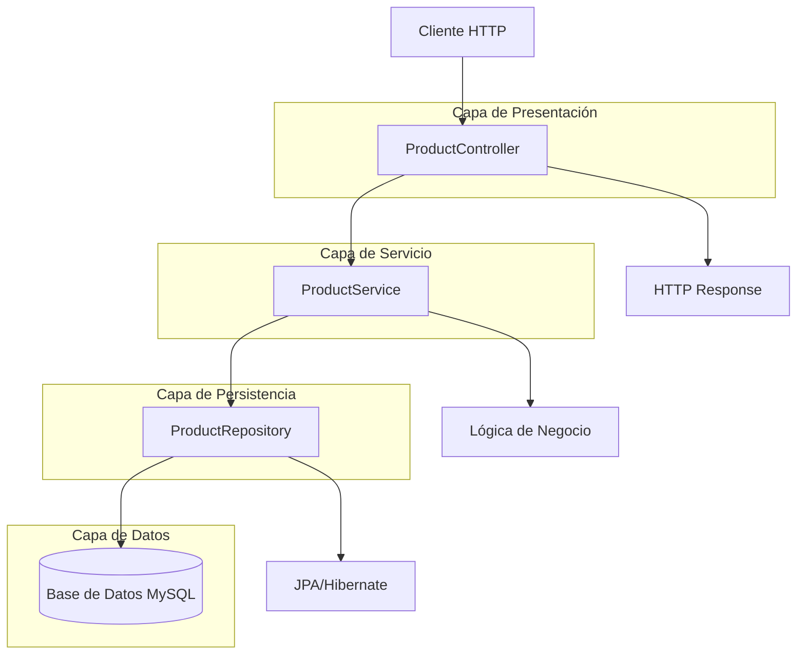
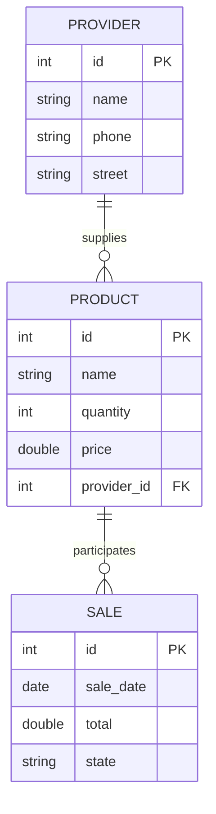

# Arquitectura del Sistema

## Diagrama de Arquitectura

## Descripción de la Arquitectura

La aplicación sigue una arquitectura en capas típica de Spring Boot:

### 1. Capa de Presentación (Controller)
- **ProductController**: Maneja las solicitudes REST HTTP
- Expone endpoints para operaciones CRUD
- Convierte datos entre JSON y objetos Java

### 2. Capa de Servicio (Service)
- **ProductService**: Contiene la lógica de negocio
- Coordina operaciones entre controller y repository
- Maneja validaciones y reglas de negocio

### 3. Capa de Persistencia (Repository)
- **ProductRepository**: Interfaz que extiende JpaRepository
- Proporciona métodos CRUD automáticos
- Ejecuta consultas personalizadas

### 4. Capa de Datos (Entity)
- **Product, Provider, Sale**: Entidades JPA
- Representan las tablas de la base de datos
- Definen relaciones entre entidades

## Relaciones entre Entidades

### Relaciones:
- Un **Producto** pertenece a un **Proveedor** (Many-to-One)
- Un **Producto** puede participar en múltiples **Ventas** (Many-to-Many)
- Una **Venta** puede incluir múltiples **Productos** (Many-to-Many)

## Flujo de Datos

1. El cliente envía una solicitud HTTP al Controller
2. El Controller delega la lógica al Service
3. El Service interactúa con el Repository para acceder a datos
4. El Repository usa JPA/Hibernate para ejecutar consultas SQL
5. Los datos se devuelven a través de las capas inversas
6. El Controller retorna la respuesta HTTP al cliente

## Tecnologías de Persistencia

- **JPA (Java Persistence API)**: Especificación para mapeo objeto-relacional
- **Hibernate**: Implementación de JPA
- **MySQL**: Base de datos relacional
- **H2**: Base de datos en memoria para pruebas

## Configuración

La configuración de la base de datos se maneja en `application.properties`:

- URL de conexión
- Credenciales
- Dialecto de Hibernate
- Estrategia de DDL